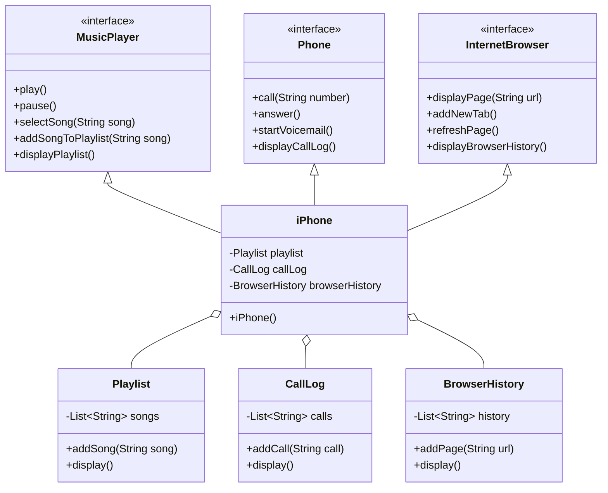

# Simulation des fonctionnalités de l'iPhone

Ce projet est une simulation des fonctionnalités d'un iPhone, basée sur les caractéristiques de son lancement en 2007. La simulation comprend trois fonctionnalités principales : Lecteur de musique, téléphone et navigateur Internet.

## Table des matières
- [Vue d'ensemble](#vue-d'ensemble)
- [Fonctionnalités](#fonctionnalités)
- [Diagramme UML](#diagramme-uml)
- [Comment fonctionner](#comment-fonctionner)
- [Contribuer](#contribuer)
- [Licence](#licence)

## Vue d'ensemble

Le projet est structuré selon les principes de la programmation orientée objet (POO) et est représenté à l'aide de diagrammes UML. Les fonctionnalités sont implémentées en Java, montrant comment les interfaces et les classes peuvent être utilisées pour simuler les capacités de l'iPhone.

## Fonctionnalités

### Lecteur de musique
- **Méthodes:**
    - `play()` : Joue la chanson en cours.
    - `pause()` : Met en pause la chanson en cours.
    - `selectSong(String song)` : Sélectionne une chanson spécifique à jouer.
    - `addSongToPlaylist(String song)` : Ajoute une chanson à la liste de lecture.
    - `displayPlaylist()` : Affiche la liste de lecture en cours.

### Téléphone
- **Methods:**
    - `call(String number)` : Passe un appel au numéro spécifié.
    - `answer()` : Répond à un appel entrant.
    - `startVoicemail()` : Démarre le service de messagerie vocale.
    - `displayCallLog()` : Affiche le journal des appels.

### Navigateur Internet
- **Methods:**
    - `displayPage(String url)` : Affiche une page web pour une URL donnée.
    - `addNewTab()` : Ajoute un nouvel onglet dans le navigateur.
    - `refreshPage()` : Rafraîchit la page web actuelle.
    - `displayBrowserHistory()` : Affiche l'historique de navigation.

## Diagramme UML

Voici le diagramme UML du projet :

## Comment fonctionner
1. Clonez le dépôt.
2. Naviguez vers le répertoire du projet.
3. Compilez les fichiers Java.
4. Exécutez la classe iPhone pour voir la simulation en action.

### Contribuer
N'hésitez pas à forker le dépôt et à soumettre des demandes de téléchargement. Les contributions sont les bienvenues !

### Licence
Ce projet est placé sous la licence MIT. Voir le fichier [LICENSE]() pour plus de détails.