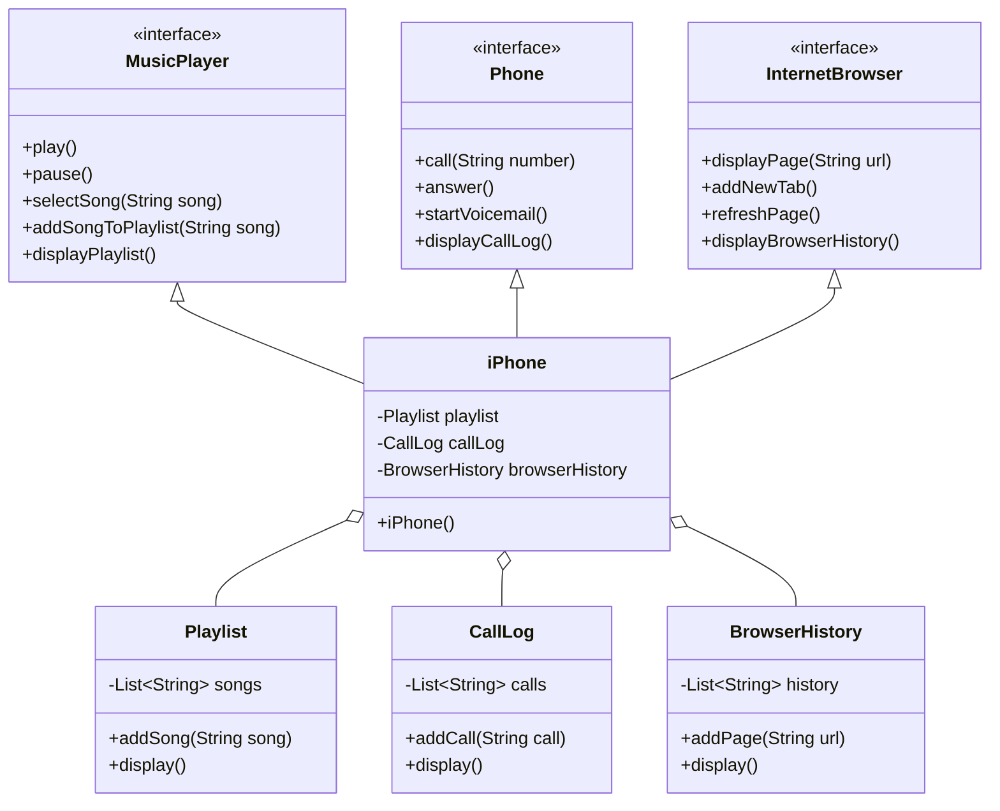

# Simulação da funcionalidade do iPhone

Este projeto é uma simulação das funcionalidades de um iPhone, com base em seus recursos de lançamento de 2007. A simulação inclui três funcionalidades principais: Reprodutor de música, telefone e navegador de Internet.

## Índice
- [Visão geral](#visão-geral)
- [Funcionalidades](#funcionalidades)
- [Diagrama UML](#diagrama-uml)
- [Como executar](#como-executar)
- [Contribuindo](#contribuindo)
- [Licença](#licença)

## Visão geral

O projeto é estruturado usando princípios de programação orientada a objetos (POO) e é representado por meio de diagramas UML. As funcionalidades são implementadas em Java, mostrando como as interfaces e as classes podem ser usadas para simular os recursos do iPhone.

## Funcionalidades

### Reprodutor de música
- Métodos:**
    - `play()`: Reproduz a música atual.
    - `pause()`: Pausa a música atual.
    - `selectSong(String song)`: Seleciona uma música específica para ser reproduzida.
    - `addSongToPlaylist(String song)`: Adiciona uma música à lista de reprodução.
    - `displayPlaylist()`: Exibe a lista de reprodução atual.

### Telefone
- Métodos:**
    - `call(String number)`: Faz uma chamada para um número especificado.
    - `answer()`: Atende a uma chamada recebida.
    - `startVoicemail()`: Inicia o serviço de correio de voz.
    - `displayCallLog()`: Exibe o registro de chamadas.

### Navegador de Internet
- Métodos:**
    - `displayPage(String url)`: Exibe uma página da Web para um determinado URL.
    - `addNewTab()`: Adiciona uma nova guia no navegador.
    - `refreshPage()`: Atualiza a página da Web atual.
    - `displayBrowserHistory()`: Exibe o histórico de navegação.

## Diagrama UML

A seguir, o diagrama UML do projeto:

## Como executar
1. Clone o repositório.
2. Navegue até o diretório do projeto.
3. Compile os arquivos Java.
4. Execute a classe do iPhone para ver a simulação em ação.

### Contribuindo
Sinta-se à vontade para fazer o fork do repositório e enviar solicitações pull. As contribuições são bem-vindas!

### Licença
Este projeto está licenciado sob a licença MIT. Consulte o arquivo [LICENSE]() para obter mais detalhes.
