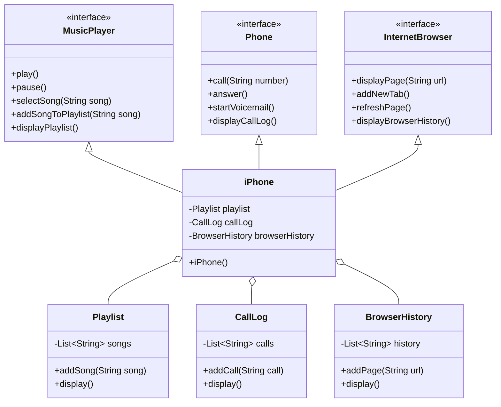

[🇧🇷️](https://github.com/iFallenHunt/POO-Challenge/blob/main/README-PTBR.md)[🇫🇷️](https://github.com/iFallenHunt/POO-Challenge/blob/main/README-FR.md)

# iPhone Functionality Simulation

This project is a simulation of the functionalities of an iPhone, based on its 2007 launch features. The simulation includes three main functionalities: Music Player, Phone, and Internet Browser.

## Table of Contents
- [Overview](#overview)
- [Functionalities](#functionalities)
- [UML Diagram](#uml-diagram)
- [How to Run](#how-to-run)  
- [Contributing](#contributing)
- [License](#license)

## Overview

The project is structured using Object-Oriented Programming (OOP) principles and is represented using UML diagrams. The functionalities are implemented in Java, showcasing how interfaces and classes can be used to simulate the iPhone's capabilities.

## Functionalities

### Music Player
- **Methods:**
    - `play()`: Play the current song.
    - `pause()`: Pause the current song.
    - `selectSong(String song)`: Select a specific song to play.
    - `addSongToPlaylist(String song)`: Add a song to the playlist.
    - `displayPlaylist()`: Display the current playlist.

### Phone
- **Methods:**
    - `call(String number)`: Make a call to a specified number.
    - `answer()`: Answer an incoming call.
    - `startVoicemail()`: Start the voicemail service.
    - `displayCallLog()`: Display the call log.

### Internet Browser
- **Methods:**
    - `displayPage(String url)`: Display a webpage for a given URL.
    - `addNewTab()`: Add a new tab in the browser.
    - `refreshPage()`: Refresh the current webpage.
    - `displayBrowserHistory()`: Display the browsing history.

## UML Diagram

The following is the UML diagram for the project:

## How to Run
1. Clone the repository.
2. Navigate to the project directory.
3. Compile the Java files.
4. Run the iPhone class to see the simulation in action.

### Contributing
Feel free to fork the repository and submit pull requests. Contributions are welcome!

### License
This project is licensed under the MIT License. See the [LICENSE](https://github.com/iFallenHunt/POO-Challenge/blob/main/LICENSE) file for more details.